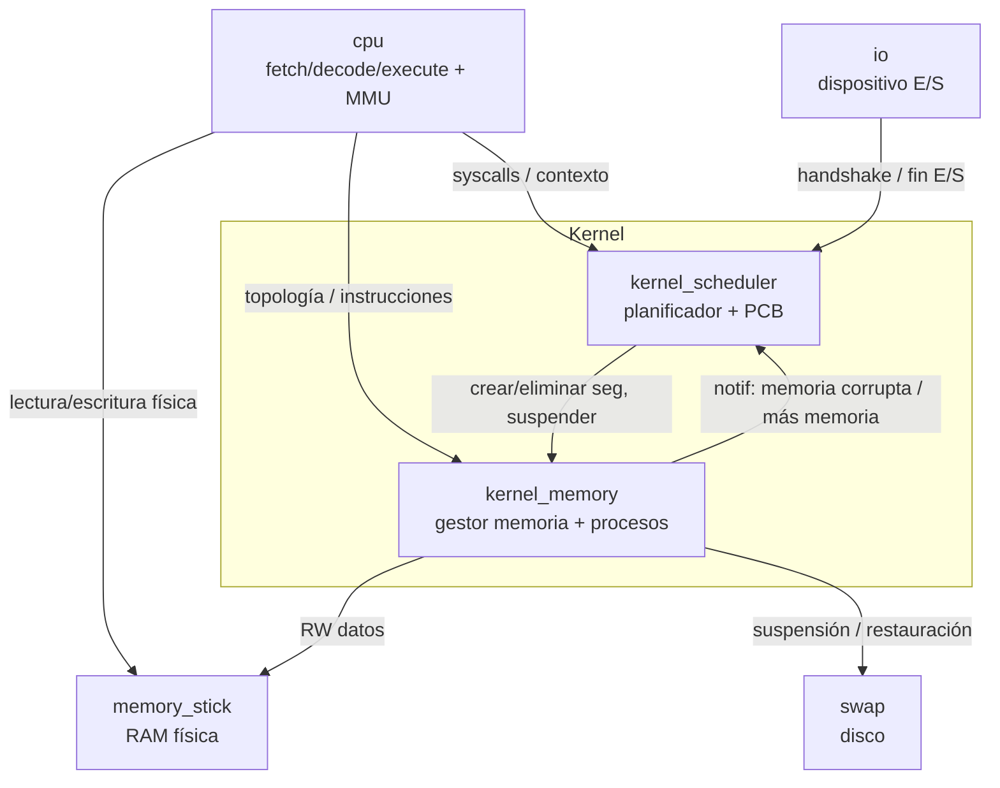
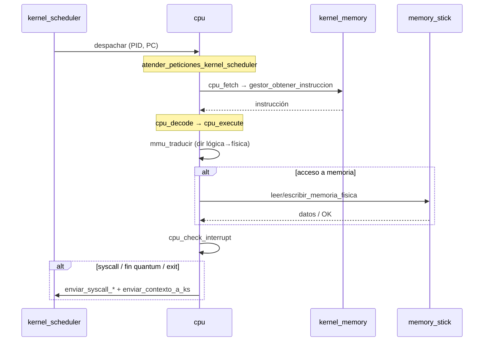
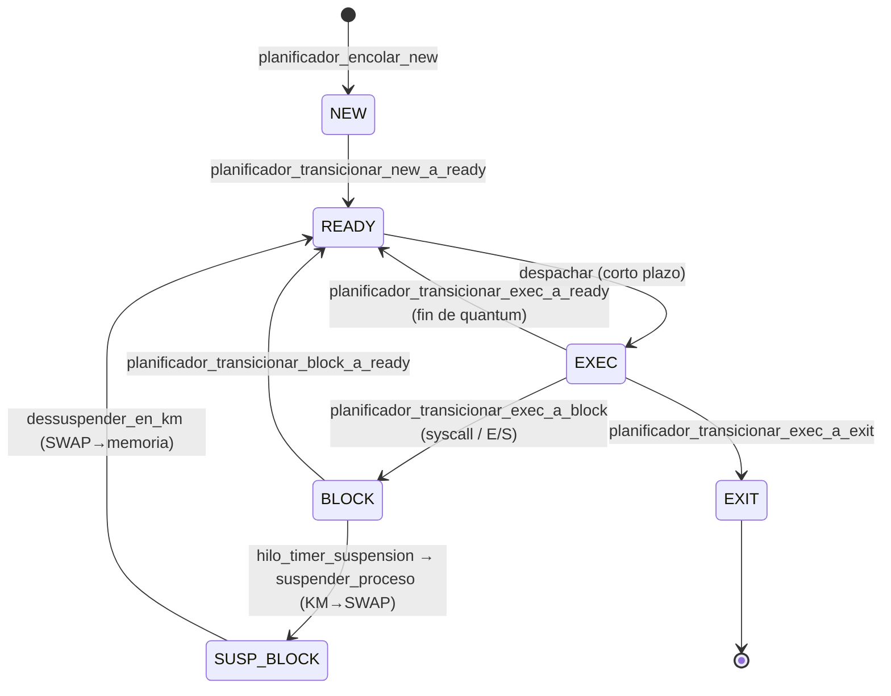
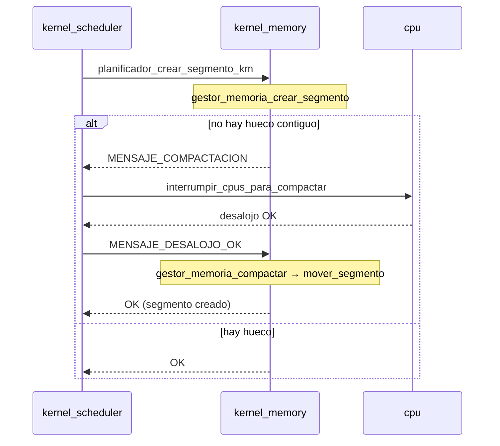
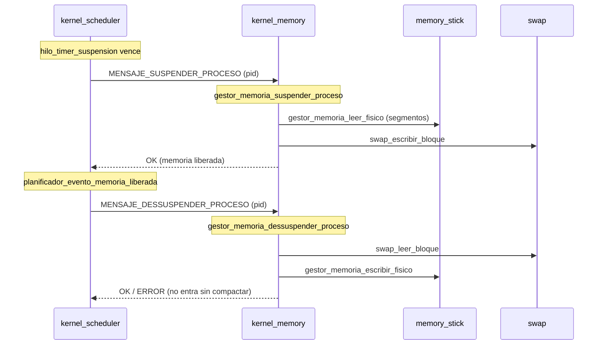
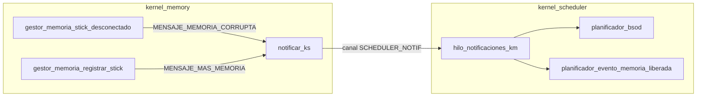

# Documentación de funciones — Plug & Pray

Documentación funcional del TP de Sistemas Operativos (UTN FRBA). Lista todas las
funciones por módulo con una descripción breve de cada una, más diagramas de
arquitectura y de los flujos donde las funciones se interrelacionan.

## Índice

- [Visión general de la arquitectura](#visión-general-de-la-arquitectura)
- [Módulo `utils` (biblioteca compartida)](#módulo-utils-biblioteca-compartida)
- [Módulo `cpu`](#módulo-cpu)
- [Módulo `kernel_scheduler`](#módulo-kernel_scheduler)
- [Módulo `kernel_memory`](#módulo-kernel_memory)
- [Módulo `memory_stick`](#módulo-memory_stick)
- [Módulo `swap`](#módulo-swap)
- [Módulo `io`](#módulo-io)
- [Diagramas de flujo entre funciones](#diagramas-de-flujo-entre-funciones)

---

## Visión general de la arquitectura

El sistema simula un SO distribuido en **7 módulos** que se comunican por sockets
TCP hablando un protocolo común (`utils/protocolo.h`).

| Módulo | Rol | Se conecta a |
|---|---|---|
| **kernel_scheduler** (KS) | Planificador de largo/corto/mediano plazo. Administra PCBs, estados, mutexes y syscalls. | kernel_memory, CPU (servidor), IO (servidor) |
| **kernel_memory** (KM) | Administrador de memoria. Segmentación, compactación, SWAP, instrucciones de procesos. | memory_stick (cliente), swap (cliente), CPU (servidor), KS (servidor) |
| **cpu** | Ciclo fetch-decode-execute + MMU. Ejecuta instrucciones y dispara syscalls. | kernel_scheduler, kernel_memory, memory_stick (RW físico) |
| **memory_stick** | Nodo de memoria física (RAM). Guarda los bytes reales. | kernel_memory (servidor) |
| **swap** | Almacenamiento en disco para procesos suspendidos. | kernel_memory (servidor) |
| **io** | Interfaz de Entrada/Salida (dispositivos). | kernel_scheduler |
| **utils** | Biblioteca estática compartida por todos: protocolo, sockets, boot. | — |

**Handshakes** (primer `int32` al conectar, ver `protocolo.h`):
`CPU=1`, `IO=2`, `SCHEDULER=3`, `MEMORY_STICK=4`, `SWAP=5`,
`SCHEDULER_NOTIF=6` (canal exclusivo de notificaciones KM→KS),
`KERNEL_MEMORY=7` (KM como cliente del stick).

---

## Módulo `utils` (biblioteca compartida)

Código común incluido por todos los módulos.

### `sockets/sockets.c` — TCP básico
| Función | Descripción |
|---|---|
| `crear_servidor(puerto)` | Crea un socket de escucha (bind + listen) en el puerto dado y devuelve su fd. |
| `crear_conexion(ip, puerto)` | Abre una conexión cliente TCP hacia `ip:puerto` y devuelve el fd conectado. |

### `boot_loader/boot_loader.c` — arranque de módulos
| Función | Descripción |
|---|---|
| `validate_config_rules(config, required_keys, num_keys, boot_logger)` | Verifica que el archivo de config tenga todas las claves obligatorias. |
| `system_boot(module_name, config_path, required_keys, num_keys, out_config, out_logger)` | Rutina de arranque estándar: carga config, valida claves y crea logger. Devuelve config y logger por parámetro. |

### `protocolo.c` — traducción de códigos del protocolo
| Función | Descripción |
|---|---|
| `codigo_mensaje_to_string(codigo)` | Nombre legible de un `t_codigo_mensaje` (para logs). |
| `codigo_syscall_to_string(codigo)` | Nombre legible de un `t_codigo_syscall` (para logs). |

### `instrucciones.c` — instrucciones de procesos
| Función | Descripción |
|---|---|
| `cod_instruccion_to_string(codigo)` | Nombre legible de un opcode de instrucción (NOOP, WRITE, GOTO…). |
| `parametros_to_string(inst)` | Serializa los parámetros de una instrucción a texto para logging. |

### Headers de solo datos
`estados.h` (enum de estados del PCB), `registros.h` (struct de registros de CPU),
`segmento.h` (struct de segmento), `protocolo.h`/`instrucciones.h` (enums y structs
de mensajes). No contienen funciones.

---

## Módulo `cpu`

Ejecuta el ciclo de instrucción y traduce direcciones lógicas a físicas (MMU).

### `main.c`
| Función | Descripción |
|---|---|
| `main(argc, argv)` | Punto de entrada: arranca CPU, conecta a KS y KM, y lanza el bucle de atención. |

### `config/cpu_config.c`
| Función | Descripción |
|---|---|
| `cpu_config_create(path, logger)` | Carga y valida el archivo de configuración de la CPU. |
| `cpu_config_log(config, logger)` | Loguea los valores de configuración cargados. |
| `cpu_config_destroy(config)` | Libera la config. |
| `tiene_todas_las_propiedades(config)` *(static)* | Chequea que estén todas las claves requeridas. |

### `logger/cpu_logger.c`
| Función | Descripción |
|---|---|
| `cpu_boot_logger_create()` | Logger temporal usado durante el arranque. |
| `cpu_logger_create(config)` | Logger definitivo según nivel/archivo de la config. |

### `cpu/cpu.c` — estructura y bucle principal
| Función | Descripción |
|---|---|
| `cpu_create(socket_kernel, socket_memoria, id_cpu, segment_max_size)` | Crea el contexto de ejecución de la CPU (sockets, id, límite de segmento). |
| `cpu_destroy(cpu)` | Libera el contexto de la CPU. |
| `stick_cpu_destroy(elemento)` *(static)* | Destructor de un stick en la topología cacheada por la CPU. |
| `atender_peticiones_kernel_scheduler(cpu, logger)` | Bucle principal: recibe PID/PC del KS, ejecuta el proceso y devuelve el contexto. |

### `instrucciones/instrucciones.c` — ciclo de instrucción + MMU
| Función | Descripción |
|---|---|
| `mmu_traducir(cpu, dir_logica, tamanio, logger)` *(static)* | MMU: traduce dirección lógica → física validando límites de segmento (dispara SEG_FAULT si es inválida). |
| `cpu_fetch(cpu, logger)` | Pide al KM la instrucción apuntada por el PC. |
| `cpu_decode(raw, out)` | Parsea el texto de la instrucción a struct `t_instruccion`. |
| `cpu_execute(cpu, inst, logger)` | Ejecuta la instrucción (WRITE/READ/GOTO/syscalls/mutex/mem_alloc…) y actualiza registros. |
| `cpu_check_interrupt(cpu, logger)` | Consulta si el KS pidió interrumpir (desalojo por quantum o compactación). |

### `registros_cpu/registros_cpu.c` — banco de registros
| Función | Descripción |
|---|---|
| `get_registro(cpu, nombre)` | Lee un registro de 8 bits por nombre. |
| `set_registro(cpu, nombre, valor)` | Escribe un registro de 8 bits. |
| `get_registro_32(cpu, nombre)` | Lee un registro de 32 bits (PC, EAX…). |
| `set_registro_32(cpu, nombre, valor)` | Escribe un registro de 32 bits. |
| `tamanio_registro(nombre)` | Devuelve el tamaño en bytes de un registro por nombre. |

### `conexiones/conexiones.c` — comunicación con KS, KM y sticks
| Función | Descripción |
|---|---|
| `conectar_a_kernel_scheduler(ip, puerto, id_cpu, logger)` | Handshake y conexión con el KS. |
| `conectar_a_kernel_memory(ip, puerto, id_cpu, segment_max_size, logger)` | Conexión con KM; recibe el tamaño máximo de segmento. |
| `enviar_syscall_a_ks(cpu, syscall_tipo, logger)` *(static)* | Helper genérico para enviar una syscall al KS. |
| `enviar_syscall_sleep(cpu, tiempo, logger)` | Syscall SLEEP (bloqueo temporizado). |
| `enviar_syscall_exit(cpu, logger)` | Syscall EXIT (fin de proceso). |
| `enviar_syscall_seg_fault(cpu, logger)` | Notifica al KS un fallo de segmento detectado por la MMU. |
| `enviar_syscall_stdin(cpu, dir_logica, tam, logger)` | Syscall STDIN (lectura por E/S). |
| `enviar_syscall_stdout(cpu, dir_logica, tam, logger)` | Syscall STDOUT (escritura por E/S). |
| `enviar_contexto_a_ks(cpu, logger)` | Devuelve el contexto de ejecución (registros) al KS. |
| `enviar_syscall_mutex_create(cpu, nombre, logger)` | Syscall MUTEX_CREATE. |
| `enviar_syscall_mutex_lock(cpu, nombre, logger)` | Syscall MUTEX_LOCK. |
| `enviar_syscall_mutex_unlock(cpu, nombre, logger)` | Syscall MUTEX_UNLOCK. |
| `enviar_syscall_mem_alloc(cpu, id_segmento, tamanio, logger)` | Syscall MEM_ALLOC (crear segmento). |
| `enviar_syscall_mem_free(cpu, id_segmento, logger)` | Syscall MEM_FREE (liberar segmento). |
| `enviar_syscall_init_proc(cpu, archivo, prioridad, logger)` | Syscall INIT_PROC (crear un nuevo proceso). |
| `solicitar_contexto_a_km(cpu, logger)` | Pide a KM el contexto del proceso a ejecutar. |
| `actualizar_topologia_sticks(cpu, logger)` | Pide a KM la topología de memory sticks y la cachea localmente. |
| `buscar_stick_por_id(cpu, id)` *(static)* | Busca un stick cacheado por su id. |
| `stick_para_direccion(cpu, dir)` *(static)* | Determina a qué stick pertenece una dirección física. |
| `stick_operar(stick, escribir, dir_local, tamanio, buffer)` *(static)* | Ejecuta lectura/escritura contra un stick puntual. |
| `operar_fisico(cpu, escribir, dir_fisica, tamanio, buffer, logger)` *(static)* | Enruta una operación física al stick correcto (maneja cruces de límite). |
| `leer_memoria_fisica(cpu, dir_fisica, tamanio, destino, logger)` | Lee bytes desde la memoria física. |
| `escribir_memoria_fisica(cpu, dir_fisica, tamanio, origen, logger)` | Escribe bytes en la memoria física. |

---

## Módulo `kernel_scheduler`

El planificador. Administra la vida de los procesos (PCB), los estados y la
sincronización. Es el más grande del sistema.

### `main.c`
| Función | Descripción |
|---|---|
| `main(argc, argv)` | Arranca KS: config, conexión con KM, crea el planificador y levanta el servidor. |

### `config/kernel_scheduler_config.c`
| Función | Descripción |
|---|---|
| `kernel_scheduler_config_create(path, logger)` | Carga y valida la config del KS (algoritmos, quantum, IPs…). |
| `kernel_scheduler_config_log(config, logger)` | Loguea la config. |
| `kernel_scheduler_config_destroy(config)` | Libera la config. |
| `tiene_todas_las_propiedades(config)` *(static)* | Valida claves requeridas. |

### `logger/kernel_scheduler_logger.c`
| Función | Descripción |
|---|---|
| `kernel_scheduler_boot_logger_create()` | Logger de arranque. |
| `kernel_scheduler_logger_create(config)` | Logger definitivo. |

### `pcb/pcb.c` — Process Control Block
| Función | Descripción |
|---|---|
| `pcb_create(pid, path_instrucciones)` | Crea un PCB nuevo con su PID, path y registros en cero. |
| `pcb_destroy(pcb)` | Libera un PCB. |

### `mutex_kernel/mutex_kernel.c` — mutexes de usuario
| Función | Descripción |
|---|---|
| `mutex_kernel_create(nombre)` | Crea un mutex nombrado (con cola de bloqueados y dueño). |
| `mutex_kernel_destroy(mutex)` | Libera un mutex. |

### `conexiones/conexiones.c` — servidor y clientes
| Función | Descripción |
|---|---|
| `iniciar_servidor_kernel_scheduler(puerto, planificador, config, logger)` | Levanta el servidor del KS y despacha cada cliente (CPU/IO) a un hilo. |
| `manejar_cliente(arg)` | Hilo por cliente: identifica por handshake y deriva a la atención correspondiente. |
| `liberar_cpu(cpu)` *(static)* | Marca una CPU como libre tras terminar un proceso. |
| `finalizar_proceso(pcb, motivo)` *(static)* | Rutina común de finalización de un proceso con su motivo. |
| `atender_peticiones_cpu(socket_cpu, id_cpu)` | Bucle que atiende syscalls y contextos de una CPU (el corazón de la interacción CPU↔KS). |
| `conectar_a_kernel_memory(ip, puerto, logger)` | Conecta el KS a KM (canal principal de comandos). |
| `hilo_notificaciones_km(arg)` *(static)* | Hilo que escucha el canal de notificaciones asíncronas de KM (memoria corrupta / más memoria). |
| `conectar_canal_notificaciones_km(ip, puerto, planificador, logger)` | Abre el segundo canal KS→KM dedicado a notificaciones. |

### `planificador/planificador.c` — núcleo de planificación

**Ciclo de vida / estructura**
| Función | Descripción |
|---|---|
| `planificador_create(config, logger, socket_memoria)` | Crea el planificador: colas de estados, semáforos, algoritmos configurados. |
| `planificador_destroy(pl)` | Libera todo el planificador. |
| `io_conectada_destroy(elemento)` *(static)* | Destructor de una IO registrada. |

**Hilos planificadores**
| Función | Descripción |
|---|---|
| `hilo_planificador_largo_plazo(arg)` | Planificador de largo plazo: admite procesos de NEW a READY según memoria disponible. |
| `hilo_planificador_corto_plazo(arg)` | Planificador de corto plazo: elige el próximo proceso de READY y lo despacha a una CPU. |
| `hilo_timer_quantum(arg)` *(static)* | Temporizador de quantum para Round Robin / VRR: interrumpe la CPU al vencer. |
| `hilo_timer_suspension(arg)` *(static)* | Temporizador de suspensión: mueve a SWAP un proceso bloqueado demasiado tiempo. |

**Selección de cola / desalojo (helpers static)**
| Función | Descripción |
|---|---|
| `es_cmn(pl)` | Indica si el algoritmo es Colas Multinivel. |
| `cola_de(pl, pcb)` | Determina en qué cola de ready va un PCB según su prioridad. |
| `cola_usa_rr(pl, cola)` | Indica si esa cola usa Round Robin. |
| `chequear_desalojo_por_prioridad(pl, nuevo)` | Desaloja de EXEC si llega un proceso más prioritario. |
| `encolar_en_ready(pl, pcb, al_frente)` | Inserta un PCB en la cola de ready correcta. |
| `desencolar_ready(pl)` | Extrae el próximo PCB a ejecutar según el algoritmo. |
| `despachar(pl, pcb, cpu)` *(static)* | Envía un PCB a una CPU concreta y marca EXEC. |
| `remover_de_exec(pl, pid)` *(static)* | Saca un PCB de la lista de ejecución por PID. |
| `exec_a_ready(pl, pcb, al_frente)` *(static)* | Transición interna EXEC→READY (frente o final). |

**Transiciones de estado (API pública)**
| Función | Descripción |
|---|---|
| `planificador_encolar_new(pl, pcb)` | Encola un proceso recién creado en NEW. |
| `planificador_transicionar_new_a_ready(pl, pcb)` | Admite un proceso: NEW→READY. |
| `planificador_transicionar_exec_a_exit(pl, pcb, motivo)` | Finaliza un proceso: EXEC→EXIT. |
| `planificador_transicionar_exec_a_ready(pl, pcb)` | Devuelve a ready (fin de quantum): EXEC→READY. |
| `planificador_transicionar_exec_a_ready_frente(pl, pcb)` | EXEC→READY al frente (VRR con quantum restante). |
| `planificador_transicionar_exec_a_block(pl, pcb, motivo)` | Bloquea un proceso: EXEC→BLOCK. |
| `planificador_transicionar_block_a_ready(pl, pcb)` | Desbloquea: BLOCK→READY. |
| `planificador_desbloquear(pl, pid, estaba_suspendido)` | Desbloquea por PID (retorna PCB e informa si venía de SUSP_BLOCK). |
| `planificador_bloquear_por_memoria(pl, pcb, id_segmento, tamanio)` | Bloquea un proceso a la espera de memoria libre para un segmento. |
| `planificador_despachar_directo(pl, pcb, cpu)` | Despacho directo a una CPU (uso interno del corto plazo). |

**Gestión de CPUs conectadas**
| Función | Descripción |
|---|---|
| `planificador_registrar_cpu(pl, socket_cpu, id_cpu)` | Registra una CPU conectada. |
| `planificador_remover_cpu(pl, socket_cpu)` | Elimina una CPU al desconectarse. |
| `planificador_obtener_cpu_por_socket(pl, socket_cpu)` | Busca una CPU por su socket. |
| `planificador_obtener_cpu_por_id(pl, id_cpu)` | Busca una CPU por su id. |

**Gestión de IO**
| Función | Descripción |
|---|---|
| `planificador_registrar_io(pl, fd, tipo, nombre)` | Registra un dispositivo de E/S conectado. |
| `planificador_remover_io(pl, fd)` | Elimina una IO al desconectarse. |
| `planificador_tomar_io_libre(pl, tipo)` | Reserva una IO libre del tipo pedido. |
| `planificador_liberar_io(pl, io)` | Libera una IO tras terminar la operación. |
| `planificador_ejecutar_io_async(pl, pcb, tipo, param, tamanio)` | Lanza una operación de E/S en background para un proceso. |
| `sem_de_tipo_io(pl, tipo)` *(static)* | Semáforo asociado a un tipo de IO. |
| `nombre_tipo_io(tipo)` *(static)* | Nombre legible de un tipo de IO. |
| `io_enviar_pid_y_param(fd, pid, param)` *(static)* | Envía a la IO el PID y el parámetro de la operación. |
| `io_esperar_ok(fd)` *(static)* | Espera la confirmación de fin de E/S. |
| `hilo_ejecutar_io(arg)` *(static)* | Hilo que gestiona una operación de E/S completa. |

**Interacción de memoria con KM**
| Función | Descripción |
|---|---|
| `planificador_actualizar_contexto_en_km(pl, pid, registros)` | Envía a KM los registros actualizados de un proceso. |
| `planificador_leer_memoria_en_km(pl, pid, dir_logica, tamanio)` *(static)* | Lee memoria de un proceso vía KM (para STDOUT). |
| `planificador_escribir_memoria_en_km(pl, pid, dir_logica, tamanio, contenido)` *(static)* | Escribe en memoria de un proceso vía KM (para STDIN). |
| `planificador_crear_segmento_km(pl, pid, id_segmento, tamanio, hubo_compactacion)` | Pide a KM crear un segmento; maneja el caso de compactación. |
| `planificador_eliminar_segmento_km(pl, pid, id_segmento)` | Pide a KM eliminar un segmento. |
| `planificador_finalizar_proceso_km(pl, pid)` | Avisa a KM que libere toda la memoria del proceso. |
| `pausar_planificacion(pl)` / `reanudar_planificacion(pl)` *(static)* | Pausan/reanudan la planificación (usado durante compactación). |
| `interrumpir_cpus_para_compactar(pl)` *(static)* | Desaloja todas las CPUs para permitir la compactación de KM. |

**Compactación / suspensión / mutex / BSOD**
| Función | Descripción |
|---|---|
| `planificador_evento_memoria_liberada(pl)` | Reacciona a memoria liberada: intenta desuspender/admitir procesos en espera. |
| `comparar_candidatos(a, b)` *(static)* | Ordena candidatos a desuspender (por tamaño/orden). |
| `dessuspender_en_km(pl, pid)` *(static)* | Pide a KM restaurar desde SWAP un proceso suspendido. |
| `planificador_bsod(pl)` | "Blue Screen Of Death": finaliza todos los procesos (memoria corrupta). |
| `bsod_finalizar_lista(pl, lista)` / `bsod_finalizar_cola(pl, cola)` *(static)* | Finalizan en masa los procesos de una lista/cola. |
| `buscar_mutex_sin_lock(pl, nombre)` *(static)* | Busca un mutex por nombre sin tomar el lock. |
| `buscar_pcb_por_pid(pl, pid)` *(static)* | Busca un PCB en cualquier estado por PID. |
| `cambiar_prioridad(pl, pcb, nueva)` *(static)* | Cambia la prioridad de un proceso (reubica de cola). |
| `planificador_crear_mutex(pl, nombre)` | Crea un mutex de usuario (syscall MUTEX_CREATE). |
| `planificador_lock_mutex(pl, pcb, nombre)` | Toma un mutex; bloquea al proceso si está ocupado. |
| `planificador_unlock_mutex(pl, pcb_liberador, nombre)` | Libera un mutex y desbloquea al próximo en la cola. |

---

## Módulo `kernel_memory`

Administra la memoria física: segmentación dinámica, compactación, SWAP y las
instrucciones de cada proceso.

### `main.c`
| Función | Descripción |
|---|---|
| `main(argc, argv)` | Arranca KM: config, crea gestores de procesos y memoria, levanta el servidor. |

### `config/kernel_memory_config.c`
| Función | Descripción |
|---|---|
| `kernel_memory_config_create(path, logger)` | Carga y valida config (esquema, algoritmo, retardos, SWAP…). |
| `kernel_memory_config_log(config, logger)` | Loguea la config. |
| `kernel_memory_config_destroy(config)` | Libera la config. |
| `tiene_todas_las_propiedades(config)` *(static)* | Valida claves requeridas. |

### `logger/kernel_memory_logger.c`
| Función | Descripción |
|---|---|
| `kernel_memory_boot_logger_create()` | Logger de arranque. |
| `kernel_memory_logger_create(config)` | Logger definitivo. |

### `gestor_procesos/kernel_memory_gestor_procesos.c` — procesos e instrucciones
| Función | Descripción |
|---|---|
| `gestor_procesos_create()` | Crea el gestor de procesos (tabla PID→proceso). |
| `gestor_procesos_destroy(gestor)` | Libera el gestor y sus procesos. |
| `gestor_agregar_proceso(gestor, pid, path)` | Registra un proceso y carga su lista de instrucciones desde el archivo. |
| `gestor_remover_proceso(gestor, pid)` | Elimina un proceso. |
| `gestor_buscar_proceso(gestor, pid)` | Busca un proceso por PID (con lock). |
| `gestor_buscar_proceso_sin_lock(gestor, pid)` | Igual, pero asumiendo el lock ya tomado. |
| `gestor_obtener_instruccion(gestor, pid, pc, logger)` | Devuelve la instrucción del proceso en el PC indicado (fetch). |
| `gestor_lock(gestor)` / `gestor_unlock(gestor)` | Toman/liberan el mutex del gestor. |
| `destruir_proceso_km(elemento)` *(static)* | Destructor de un proceso de KM. |

### `gestor_memoria/gestor_memoria.c` — segmentación, compactación y SWAP

**Ciclo de vida / notificaciones**
| Función | Descripción |
|---|---|
| `gestor_memoria_create(config, gestor_procesos, logger)` | Crea el gestor de memoria (sticks, tabla de segmentos, estrategia). |
| `gestor_memoria_destroy(gm)` | Libera el gestor. |
| `gestor_memoria_set_notif_ks(gm, fd)` | Registra el fd del canal de notificaciones hacia el KS. |
| `notificar_ks(gm, codigo, payload)` *(static)* | Envía una notificación asíncrona al KS (memoria corrupta / más memoria). |

**Memory sticks (topología física)**
| Función | Descripción |
|---|---|
| `gestor_memoria_registrar_stick(gm, tamanio, ip, puerto)` | Registra un memory stick nuevo y amplía la memoria total. |
| `gestor_memoria_stick_desconectado(gm, id_stick)` | Maneja la caída de un stick (dispara memoria corrupta / BSOD). |
| `stick_destroy(elemento)` *(static)* | Destructor de un stick. |
| `stick_para_direccion(gm, dir)` *(static)* | Determina el stick al que pertenece una dirección física. |
| `gestor_memoria_serializar_topologia(gm, tamanio_out)` | Serializa la topología de sticks para enviarla a la CPU. |
| `escribir_uint32(p, valor)` / `escribir_string_con_longitud(p, str)` *(static)* | Helpers de serialización. |
| `tamanio_topologia_serializada(gm, cant_out)` *(static)* | Calcula el tamaño del buffer de topología. |

**Segmentos (crear / eliminar / huecos)**
| Función | Descripción |
|---|---|
| `gestor_memoria_espacio_libre(gm)` | Espacio libre total disponible. |
| `espacio_libre_sin_lock(gm)` *(static)* | Igual, sin tomar el lock. |
| `gestor_memoria_crear_segmento(gm, pid, id_segmento, tamanio)` | Crea un segmento (OK / ERROR / necesita COMPACTACIÓN). |
| `gestor_memoria_eliminar_segmento(gm, pid, id_segmento)` | Elimina un segmento y libera su hueco. |
| `gestor_memoria_finalizar_proceso(gm, pid)` | Libera todos los segmentos de un proceso. |
| `buscar_hueco(gm, tamanio, base_out)` *(static)* | Busca hueco libre según First/Best Fit. |
| `estrategia_es_best_fit(gm)` *(static)* | Indica si la estrategia configurada es Best Fit. |
| `segmentos_ordenados(gm, cant_out)` *(static)* | Devuelve los segmentos ordenados por base. |
| `comparar_por_base(a, b)` *(static)* | Comparador por dirección base. |
| `tabla_proceso_agregar(gm, pid, id_segmento, base, tamanio)` *(static)* | Registra un segmento en la tabla del proceso. |
| `coincide_segmento(pid, id_segmento, elemento)` *(static)* | Predicado de match de un segmento. |

**Acceso físico + traducción (MMU del lado memoria)**
| Función | Descripción |
|---|---|
| `gestor_memoria_traducir(gm, pid, dir_logica, tamanio, dir_fisica_out)` | Traduce dirección lógica → física validando el segmento. |
| `gestor_memoria_leer_fisico(gm, dir_fisica, tamanio, destino)` | Lee bytes de la memoria física (delegando al stick). |
| `gestor_memoria_escribir_fisico(gm, dir_fisica, tamanio, origen)` | Escribe bytes en la memoria física. |
| `gestor_memoria_io_rw(gm, pid, dir_logica, tamanio, buffer, escribir, dir_fisica_out)` | Lectura/escritura lógica combinando traducción + acceso físico (para STDIN/STDOUT). |
| `operar_fisico(gm, escribir, dir_fisica, tamanio, buffer)` *(static)* | Enruta la operación al stick correcto. |

**Compactación**
| Función | Descripción |
|---|---|
| `gestor_memoria_compactar(gm)` | Compacta la memoria: mueve todos los segmentos al inicio eliminando huecos. |
| `mover_segmento(gm, seg, nueva_base)` *(static)* | Reubica físicamente un segmento a una nueva base. |

**SWAP (mediano plazo)**
| Función | Descripción |
|---|---|
| `gestor_memoria_registrar_swap(gm, fd, tamanio_total, block_size)` | Registra el módulo SWAP y su bitmap de bloques. |
| `gestor_memoria_suspender_proceso(gm, pid)` | Suspende un proceso: baja sus segmentos a SWAP y libera su memoria. |
| `gestor_memoria_dessuspender_proceso(gm, pid)` | Restaura desde SWAP los segmentos de un proceso suspendido. |
| `swap_escribir_bloque(gm, nro_bloque, buffer)` / `swap_leer_bloque(gm, nro_bloque, buffer)` *(static)* | RW de un bloque en el archivo de SWAP. |
| `swap_bloques_libres(gm)` *(static)* | Cuenta bloques libres en SWAP. |
| `buscar_segmento_swap(gm, pid, id_segmento)` *(static)* | Busca un segmento swapeado. |
| `segmento_swap_destroy(elemento)` *(static)* | Destructor de un segmento en SWAP. |

### `conexiones/conexiones.c`
| Función | Descripción |
|---|---|
| `iniciar_servidor_kernel_memory(puerto, config, gestor, gestor_memoria, logger)` | Levanta el servidor de KM y despacha clientes (CPU, KS, sticks) a hilos. |
| `manejar_cliente(arg)` | Hilo por cliente: identifica por handshake y deriva a la atención correcta. |
| `atender_memory_stick(fd)` *(static)* | Registra un stick que informa su tamaño y lo agrega a la topología. |

### `atencion_cpu/kernel_memory_atencion_cpu.c`
| Función | Descripción |
|---|---|
| `atender_cpu(fd, ...)` | Atiende a una CPU: pedidos de instrucción, lectura/escritura de memoria y topología de sticks. |

### `atencion_scheduler/kernel_memory_atencion_scheduler.c`
| Función | Descripción |
|---|---|
| `atender_scheduler(fd, ...)` | Atiende al KS: crear/eliminar segmento, finalizar, suspender/dessuspender, actualizar contexto. |

### `memoria_instrucciones/memoria_instrucciones.h`
| Función | Descripción |
|---|---|
| `memoria_instrucciones_fetch(pid, pc)` | Devuelve la instrucción de un proceso en un PC dado (interfaz de fetch). |

---

## Módulo `memory_stick`

Nodo de memoria física: guarda los bytes reales de los procesos.

### `main.c`
| Función | Descripción |
|---|---|
| `main(argc, argv)` | Arranca el stick: crea su memoria, informa su tamaño a KM y atiende operaciones. |

### `config/memory_stick_config.c`
| Función | Descripción |
|---|---|
| `memory_stick_config_create(path, logger)` | Carga y valida la config (tamaño, IP/puerto de KM…). |
| `memory_stick_config_log(config, logger)` | Loguea la config. |
| `memory_stick_config_destroy(config)` | Libera la config. |
| `tiene_todas_las_propiedades(config)` *(static)* | Valida claves requeridas. |

### `logger/memory_stick_logger.c`
| Función | Descripción |
|---|---|
| `memory_stick_boot_logger_create()` | Logger de arranque. |
| `memory_stick_logger_create(config)` | Logger definitivo. |

### `memoria/memoria.c` — el bloque de memoria física
| Función | Descripción |
|---|---|
| `memoria_stick_create(tamanio)` | Reserva el espacio contiguo de memoria del stick. |
| `memoria_stick_destroy(memoria)` | Libera la memoria. |
| `memoria_stick_leer(memoria, dir, tamanio, destino)` | Lee bytes desde una dirección local del stick. |
| `memoria_stick_escribir(memoria, dir, tamanio, origen)` | Escribe bytes en una dirección local del stick. |
| `rango_valido(memoria, dir, tamanio)` *(static)* | Valida que la operación no se salga del rango del stick. |

### `conexiones/conexiones.c`
| Función | Descripción |
|---|---|
| `crear_escucha_memory_stick(config, memoria, logger)` | Crea el socket de escucha del stick (para conexiones de KM/CPU). |
| `atender_conexiones_memory_stick(fd_escucha)` | Acepta conexiones entrantes y las despacha a hilos. |
| `conectar_a_kernel_memory(config, tamanio, logger)` | Se conecta a KM y le informa su tamaño. |
| `atender_peticiones(fd)` *(static)* | Atiende lecturas/escrituras físicas de un cliente. |
| `manejar_cliente(arg)` | Hilo por cliente conectado. |

---

## Módulo `swap`

Almacenamiento en disco para procesos suspendidos (mediano plazo).

### `main.c`
| Función | Descripción |
|---|---|
| `main(argc, argv)` | Arranca SWAP: abre/crea el archivo de swap y atiende a KM. |

### `config/swap_config.c`
| Función | Descripción |
|---|---|
| `swap_config_create(path, logger)` | Carga y valida la config (path del archivo, tamaño de bloque, retardo…). |
| `swap_config_log(config, logger)` | Loguea la config. |
| `swap_config_destroy(config)` | Libera la config. |
| `tiene_todas_las_propiedades(config)` *(static)* | Valida claves requeridas. |

### `logger/swap_logger.c`
| Función | Descripción |
|---|---|
| `swap_boot_logger_create()` | Logger de arranque. |
| `swap_logger_create(config)` | Logger definitivo. |

### `conexiones/conexiones.c`
| Función | Descripción |
|---|---|
| `conectar_y_atender_kernel_memory(config, archivo_swap, logger)` | Se conecta a KM, informa su tamaño y atiende lecturas/escrituras de bloques sobre el archivo de swap. |

---

## Módulo `io`

Interfaz de Entrada/Salida (dispositivos). Se conecta al KS y ejecuta las
operaciones de E/S que este le asigna.

### `main.c`
| Función | Descripción |
|---|---|
| `main(argc, argv)` | Arranca la IO: config, conexión al KS y bucle de atención de operaciones. |

### `config/io_config.c`
| Función | Descripción |
|---|---|
| `io_config_create(path, logger)` | Carga y valida la config (nivel de log, IP/puerto del KS). |
| `io_config_log(config, logger)` | Loguea la config. |
| `io_config_destroy(config)` | Libera la config. |
| `tiene_todas_las_propiedades(config)` *(static)* | Valida claves requeridas. |

### `logger/io_logger.c`
| Función | Descripción |
|---|---|
| `io_boot_logger_create()` | Logger de arranque. |
| `io_logger_create(config)` | Logger definitivo. |

### `conexiones/conexiones.c`
| Función | Descripción |
|---|---|
| `conectar_a_kernel_scheduler(ip, puerto, nombre_interfaz, logger)` | Handshake y conexión al KS informando el nombre de la interfaz. |

> `io/src/io/io_tools.h` es un header de utilidades sin funciones exportadas.

---

## Diagramas de flujo entre funciones

### 1. Ciclo de ejecución de un proceso (CPU ↔ KM ↔ KS)

### 2. Máquina de estados del planificador (kernel_scheduler)

### 3. Creación de segmento con compactación (KS ↔ KM ↔ CPUs)

### 4. Suspensión / restauración (mediano plazo con SWAP)

### 5. Notificaciones asíncronas KM → KS

